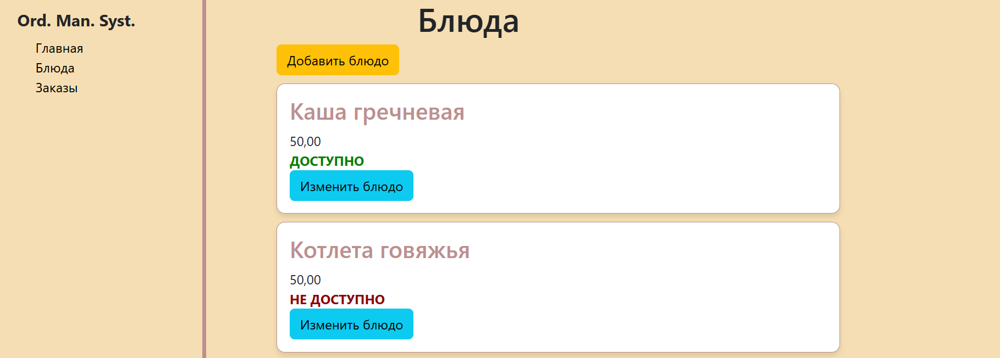
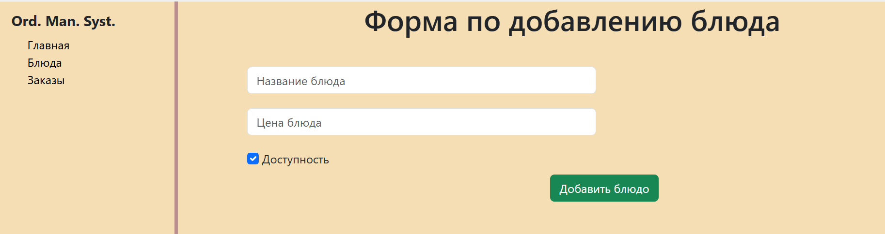
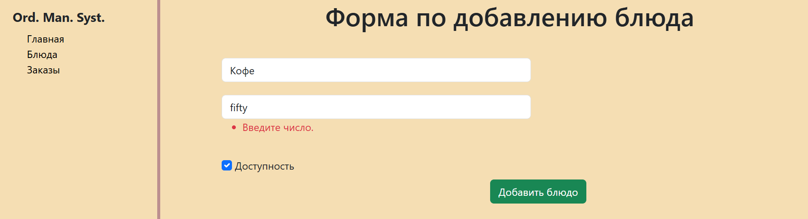
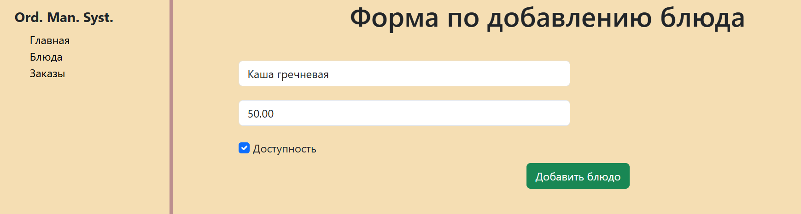
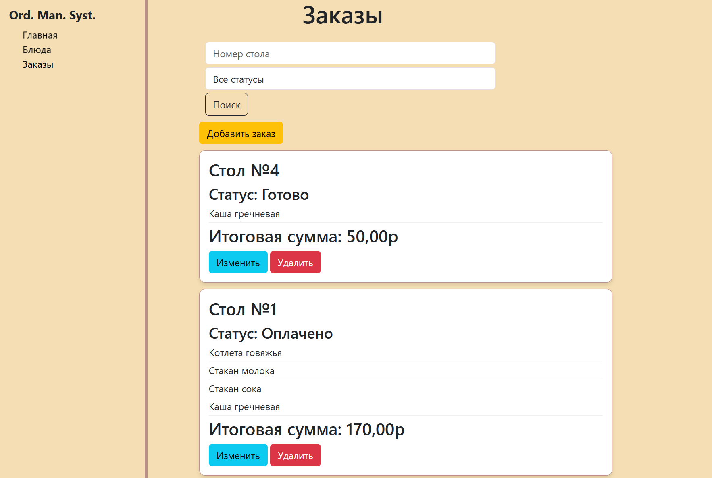
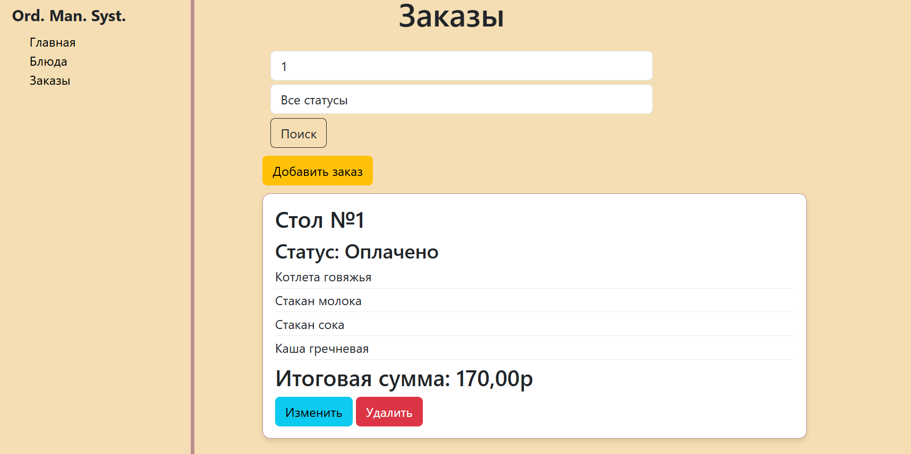
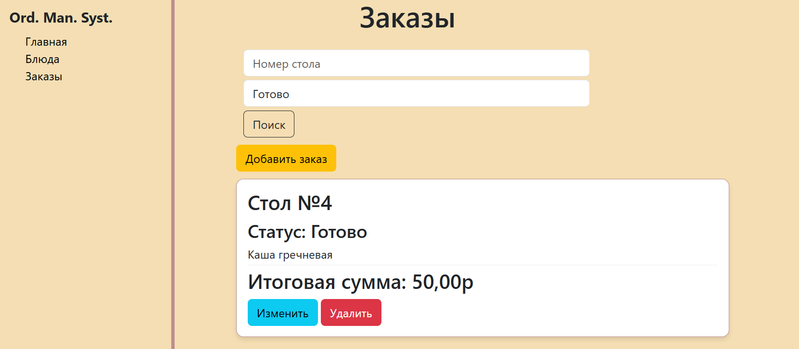
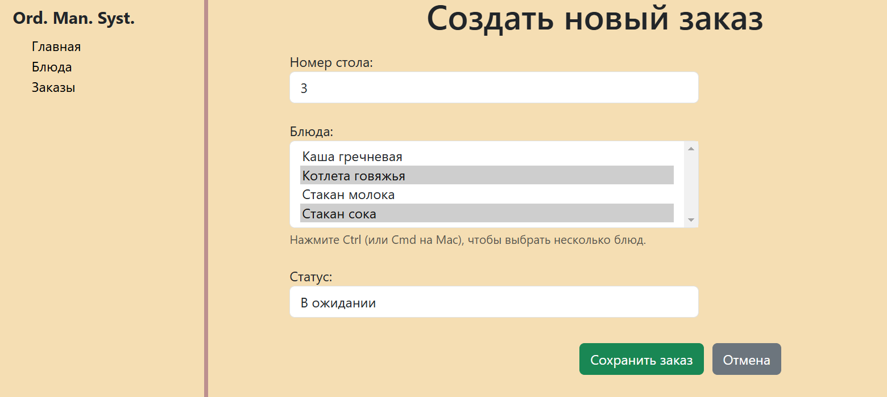
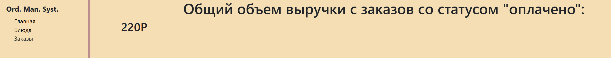

# Cafe-Order-Management-System-Django-

Веб-приложение, разработанное на Django с использованием Django REST Framework для управления заказами в кафе. Приложение позволяет добавлять, удалять, искать, изменять и отображать заказы. Содержит API для взаимодействия с приложением, протестированы оснеовные функции с помощью unittest и расширений Django TestCase, Django REST Framework APITestCase.

## Требования

Python 3.9

## Установка

1. Клонируйте репозиторий:

`git clone https://github.com/Leila132/Cafe-Order-Management-System-Django-.git`

2. Перейдите в директорию проекта:

`cd Cafe-Order-Management-System-Django-`

3. Установите зависимости:

`pip install -r requirements.txt`

## Запуск

Чтобы запустить проект, выполните:

`python manage.py runserver`

## Использование

Приложение позволяет формировать заказы, которые включают в себя следующие поля: номер стола, блюда, статус (определено только 3 статуса: "в ожидании", "готово", "оплачено"). В свою очередь блюда содержат информацию: название, цена, доступность (не реализована возможность удаления блюд, чтобы не удалять заказы, которые включали в себя удаленные блюда, поэтому можно "выключить" доступность блюда, тогда прежние заказы с этими блюдами останутся, а новые заказы с этим блюдом нельзя будет оформить)

Интерфейс приложения выглядит следющим образом. На вклаке "Блюда" можно посмотреть добавленные блюда и их доступность:

После нажатия на кнопку "Добавить блюдо" можно перейти на форму для добавления:

Присутствует валидация данных и отображение причины, по которой блюдо может не добавиться:

Если нажать "Изменить блюдо", то можно помеять каки то характеристики блюда или отключить его доступность:

На вкладке "Заказы" можно увидеть созданные заказы:

Можно отфильтровать заказы по номеру стола или статусу:

Кнопка "Добавить заказ" приводит к форме для добавления, выбираются блюда из доступных а также статус из предложенного списка, сумма заказа автоматически высчитывается после добавления:

Каждый заказ также можно изменить или удалить.

На вкладке "Главная" можно отследить сумму всех заказов со статусом "Оплачено":

## API

| `GET`  | `/api/dishs/` | Получить список всех блюд |
| `POST` | `/api/dishs/` | Создать новое блюдо |
| `GET`  | `/api/dish/1/` | Получить информацию о блюде с ID=1 |
| `PUT`  | `/api/dish/1/` | Полностью обновить блюдо с ID=1 |
| `PATCH` | `/api/dish/1/` | Частично обновить блюдо с ID=1 |

| `GET`  | `/api/orders/` | Получить список всех заказов |
| `POST` | `/api/orders/` | Создать новый заказ |
| `GET`  | `/api/orders/1/` | Получить информацию о заказе с ID=1 |
| `PUT`  | `/api/orders/1/` | Полностью обновить заказ с ID=1 |
| `PATCH` | `/api/orders/1/` | Частично обновить заказ с ID=1 |
| `DELETE` | `/api/orders/1/` | Удалить заказ с ID=1 |